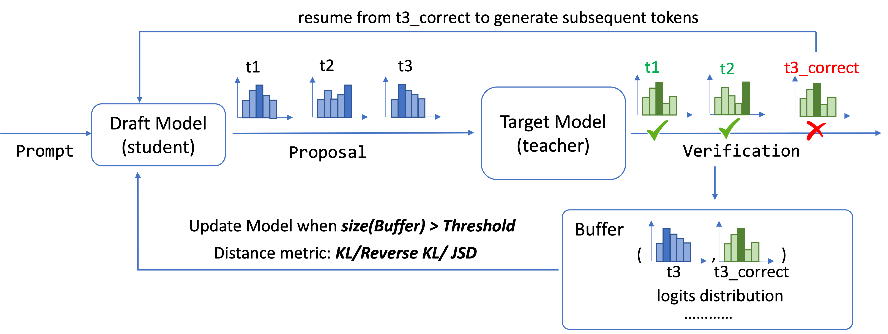

# Online Speculative Decoding (OSD)

This is the official project repository for [Online Speculative Decoding](https://arxiv.org/pdf/2310.07177.pdf) by Xiaoxuan Liu, Lanxiang Hu, Peter Bailis, Ion Stoica, Zhijie Deng, Alvin Cheung, Hao Zhang.

<p align="center"></p>

## TL;DR
Online speculative decoding (OSD) exploits spare FLOPs in LLM serving systems to refine the draft model through distillation. OSD improves the draft model's speculation accuracy and responsiveness to query distribution shifts, translating into at most 3.06x latency reduction, without sacrificing any user experience. 

## Abstract
Speculative decoding is a pivotal technique to accelerate the inference of large language models (LLMs) by employing a smaller draft model to predict the target model’s outputs. However, its efficacy can be limited due to the low predictive accuracy of the draft model, particularly when faced with diverse text inputs and a significant capability gap between the draft and target models. We introduce online speculative decoding to address this challenge. The main idea is to continually update (multiple) draft model(s) on observed user query data using the abundant excess computational power in an LLM serving cluster. Given that LLM inference is memory-bounded, the surplus computational power in a typical LLM serving cluster can be repurposed for online retraining of draft models, thereby making the training cost-neutral. Since the query distribution of an LLM service is relatively simple, retraining on query distribution enables the draft model to more accurately predict the target model’s outputs, particularly on data originating from query distributions. As the draft model evolves online, it aligns with the query distribution in real time, mitigating distribution shifts. We develop a prototype of online speculative decoding based on online knowledge distillation and evaluate it using both synthetic and real query data on several popular LLMs. The results show a substantial increase in the token acceptance rate by 0.1 to 0.65, which translates into 1.22× to 3.06× latency reduction.

## Install
1. Environment setup:
```
conda create -n osd python=3.8
conda activate osd
```
2. Clone this repository and build from source:
```
git clone https://github.com/LiuXiaoxuanPKU/OSD
cd OSD
```
3. Install dependency:
```
pip install -r requirements.txt
```

## Usage
### Prepare data
```
cd data
mkdir raw_data
python clean_{dataset}.py
```
dataset can take the value of `spider`, `finance`, `code_search`, `gsm8k`.

### LLaMA
1. Reproduce results from the paper:
```
# go back to the project root
bash bash_scripts/all.sh
```
2. Customized offline distillation:
```
bash bash_scripts/{dataset_name}/offline.sh {your_datapath} {sample_source} {distillation_method}
```
3. Customized online distillation:
```
bash bash_scripts/{dataset_name}/offline.sh {your_datapath} {sample_source} {distillation_method}
```

### T5
1. Customized offline distillation:
```
bash bash_scripts/t5/offline.sh {your_datapath} {dataset_name} {sample_source} {distillation_method}
```
2. Customized online distillation:
```
bash bash_scripts/t5/onine.sh {your_datapath} {dataset_name} {sample_source} {distillation_method}
```

### Command options
```
--student_model_path: path to the student (small) model
--teacher_model_path: path to the teacher (big) model
--mode: distillation mode. Select one from {online, offline} \
--sample_source: sampling methods. Select one from {teacher, student, mix_token, mix_request} \
--kl_method: distillation methods. Select one from {forward, reverse, jsd} \
```

### Datasets
This repo currently supports distillation and evaluation on the following datasets:

Models | GSM8K | Spider | Finance-Alpaca | CSN Python | PIQA | Starcode | Arena | CNN Dailymail | Xsum |
:---: | :---: | :---: | :---: | :---: | :---: | :---: |:---: | :---: | :---: |
 LLaMA | :heavy_check_mark: | :heavy_check_mark: | :heavy_check_mark: | :heavy_check_mark: | :heavy_check_mark: | :heavy_check_mark: | :heavy_check_mark: |  |  |
T5 | :heavy_check_mark: | :heavy_check_mark: | :heavy_check_mark: | :heavy_check_mark: |  |  |  | :heavy_check_mark: | :heavy_check_mark: |

## Citation
This is the official project repository for the following paper. If you find this repository helpful, Please cite:
```
@misc{liu2023online,
      title={Online Speculative Decoding}, 
      author={Liu, Xiaoxuan and Hu, Lanxiang and Bailis, Peter and Stoica, Ion and Deng, Zhijie and Cheung, Alvin and Zhang, Hao},
      year={2023},
      archivePrefix={arXiv},
      primaryClass={cs.AI}
}
```
